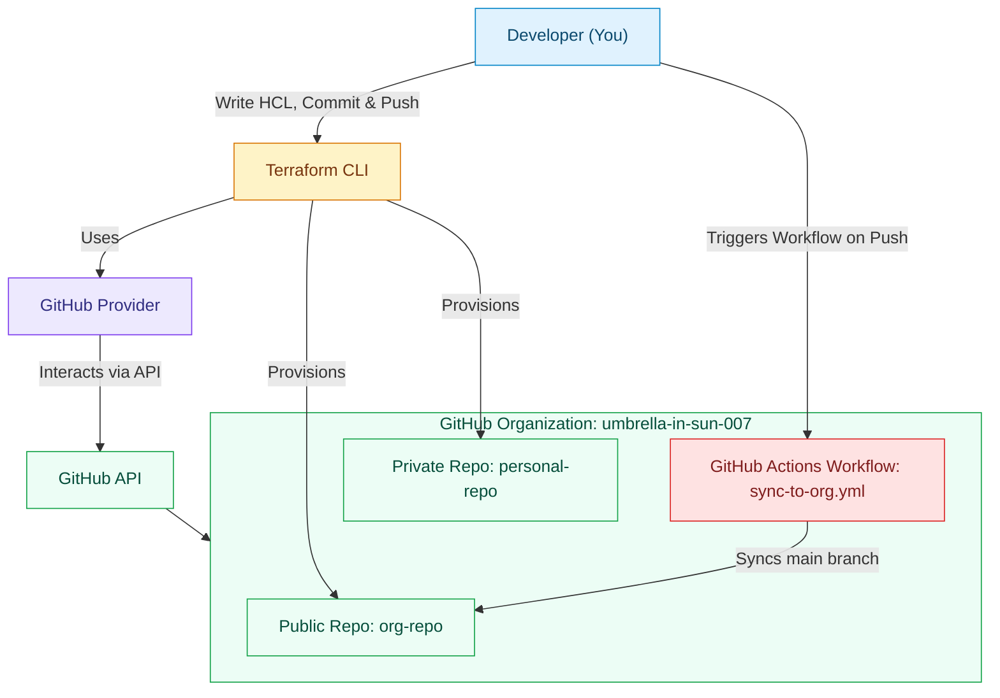

# Automated GitHub Organization Infrastructure using Terraform

Terraform provisions GitHub infrastructure using the **GitHub Provider**. We use HCL (Hashicorp Configuration Language) to define repositories, organization settings, and CI/CD automation.



## What this project does

* Provisions a **private repo** in a personal GitHub account.
* Provisions a **public repo** in a GitHub **organization**.
* Sets up a **CI GitHub Action** that syncs the main branch (production) between repos.

## Directory Structure

```
github-terraform/
├── .github
│   └── workflows
│       └── sync-to-org.yml        # CI workflow for syncing repositories
├── .gitignore                     # Ignore Terraform state & local files
├── main.tf                        # Root Terraform configuration
├── modules
│   └── organization
│       ├── main.tf                # Organization module logic
│       ├── outputs.tf             # Module outputs
│       └── variables.tf           # Module variables
├── Notes.md                       # Development and usage notes
├── outputs.tf                     # Root-level Terraform outputs
├── Provider.md                    # Provider documentation and setup notes
├── README.md                      # Project documentation
├── terraform.tfvars               # Variable values for provider setup
└── variables.tf                   # Input variable definitions
```

## Features

### 1. GitHub Organization Provisioning

* Uses **Terraform GitHub Provider** to manage org-level repositories.
* Defines access, visibility, and metadata.

### 2. Repository Management

* Private repo (user-owned)
* Public repo (org-owned)
* Repeatable creation using Terraform code

### 3. CI/CD Automation via GitHub Actions

* Workflow runs on every push to `main`.
* Syncs changes to the org repo.
* Prevents redundant runs.

## Prerequisites

* Terraform ≥ 1.6
* GitHub PAT with scopes:

  * `repo`
  * `admin:org`
  * `workflow`
* A GitHub Organization
* Git CLI access to both repos

## Steps to Run

**1. Clone repo**

```bash
git clone https://github.com/<your-username>/github-terraform.git
cd github-terraform
```

**2. Set up terraform.tfvars**
Create a file named `terraform.tfvars` in the root directory and define your variables:

```hcl
# terraform.tfvars
github_token = "ghp_yourtoken1234"
github_owner = "neerajadhav"
```

**3. Initialize Terraform**

```bash
terraform init
```

**4. Plan changes**

```bash
terraform plan
```

**5. Apply changes**

```bash
terraform apply
```

Confirm to create repos and configurations.

## sync-to-org.yml (CI Workflow)

This workflow automates synchronization between the personal and org repositories.

**Trigger:**

* Push to `main`

**Purpose:**

* Clone private repo
* Push latest commits to org repo
* Prevent reruns

## Concepts Covered

* **IaC (Infrastructure as Code)** using HCL
* **Modules** for reusable org provisioning
* **Provider Authentication** using PAT
* **Automation** through CI/CD

## Tools Used

* Terraform (HashiCorp)
* GitHub Provider
* GitHub Actions

## References

* [Terraform GitHub Provider Docs](https://registry.terraform.io/providers/integrations/github/latest/docs)
* [GitHub Actions Docs](https://docs.github.com/en/actions)
* [Terraform Modules Guide](https://developer.hashicorp.com/terraform/language/modules/develop)

## Author

**Adhav Neeraj Sahebrao**
Postgraduate | Cloud Infrastructure & DevOps | Terraform | GCP | GitHub Automation
